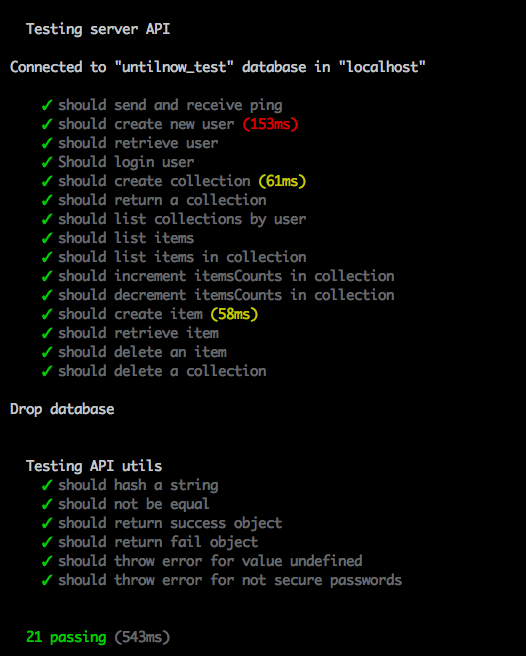
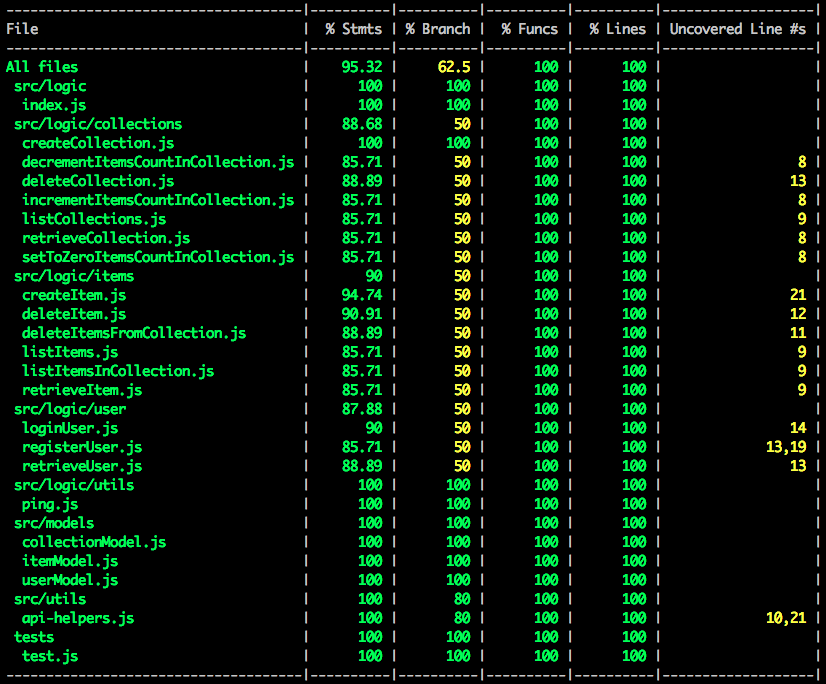

# Until Now 
En algunas actividades, como en el submarinismo o la escalada, se utilza material técnico especializado y diseñado únicamente para tal fin. Los fabricantes de dicho material establecen una duración máxima de uso para estos productos. Exceder la vida útil de los elementos usados en actividades de riesgo puede tener consecuencias letales.

Until Now te ayuda a gestionar la fecha de renovación del material técnico. La aplicación te permite visualizar rápidamente que material debes descartar y/o renovar próximamente.

## Until-Now (server API) 
Esta API provee métodos para interactuar con la capa de datos, la cual está situada en base de datos no referenciada en este repositorio.  

## Repositorios relacionados 
Este repositorio es parte del proyecto **Until Now**. Consulta los enlaces proporcionados para obtener más información.   

Enlaces relacionados:
* Repositorio principal y documentación: [Until Now frontend app](https://github.com/didaquis/until-now-frontend) 
* [Until Now client API](https://github.com/didaquis/until-now-client-api) 
* [Until Now server API](https://github.com/didaquis/until-now-server-api) 

Para hacer funcionar la aplicación, debes renombrar el fichero `_env` por `.env` y configurar las variables para la correcta utilización de la API y/o el TDD. 

También deberás instalar las dependencias. Antes de desplegar una nueva actualización, ejecuta los test (en el fichero `package.json` hay definido un script para tal fin).  

## Test & Test Coverage

  

  